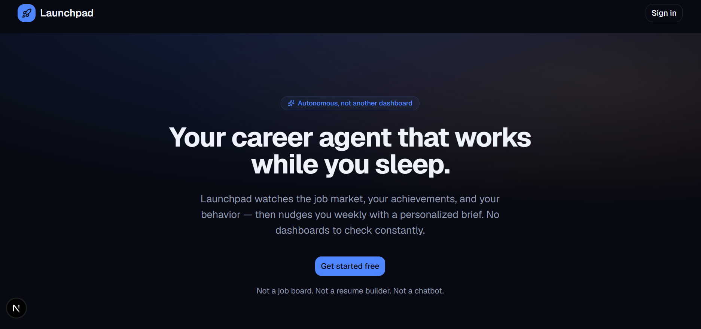
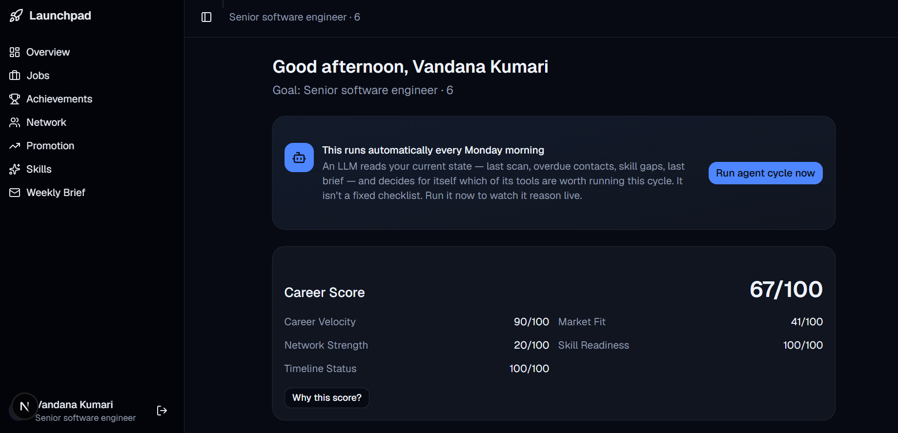
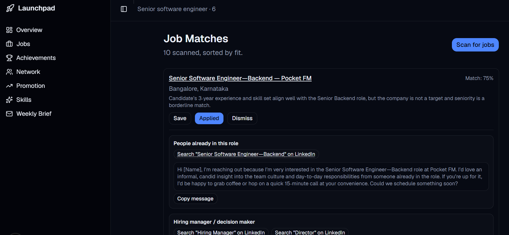
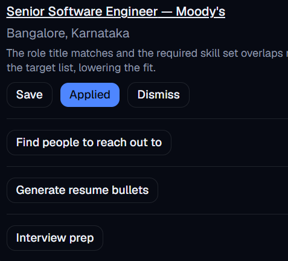
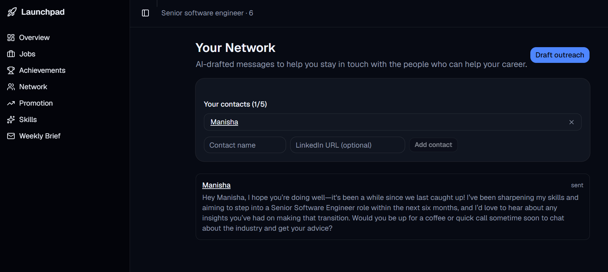
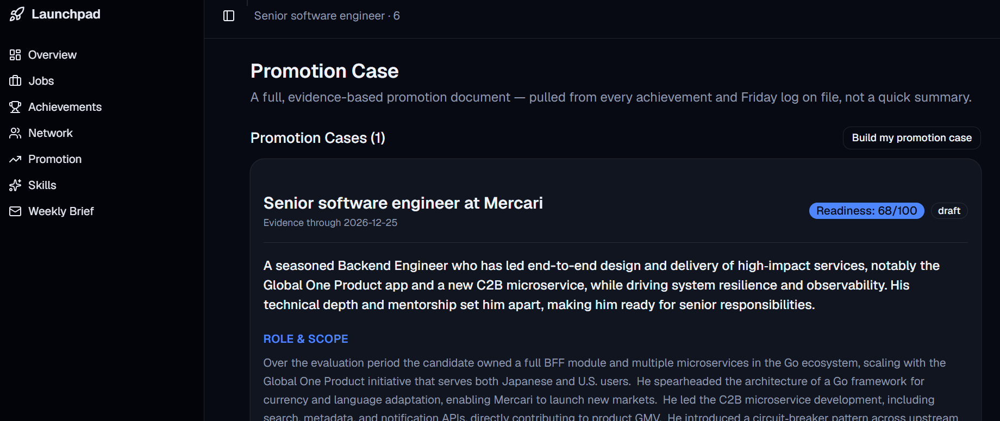
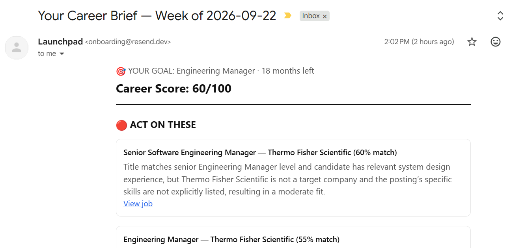

# Launchpad

An autonomous career agent. It scans the job market, tracks your achievements,
finds skill gaps, drafts network outreach, builds your promotion case, and
emails you a weekly brief — and decides for itself, each cycle, which of
those to actually do based on your current state. Full original product spec
in [LAUNCHPAD-COMPLETE-README.md](./LAUNCHPAD-COMPLETE-README.md).

**Live:** https://launchpad-ashen-six.vercel.app

## Screenshots

| | |
|---|---|
| **Landing** |  |
| **Dashboard** — agent decision log, career score |  |
| **Job matches** — fit scoring + LinkedIn outreach links |  |
| **Once applied** — outreach, resume bullets, and interview prep all unlock |  |
| **Network** — contacts + AI-drafted reconnect messages |  |
| **Promotion case** — full readiness document |  |
| **Weekly brief** — the email that actually lands |  |

## What's built

- **Auth & onboarding** — Google OAuth via Supabase, 6-step onboarding
  wizard (basics, goals, skills, network, resume upload, preferences)
- **Resume parsing** — PDF/text upload → extracted achievements via Groq
- **Job matching** — live Adzuna search + AI fit-scoring against your profile
- **Career score** — deterministic weighted score (velocity, market fit,
  network, skill readiness, timeline) — not AI, so it's stable and explainable
- **Skill gap analysis** — compares your skills against scanned job
  descriptions
- **Network outreach** — add contacts on the Network page (not just during
  onboarding), get AI-drafted reconnect messages, track sent/skipped
- **Job-match contacts** — per job match, real LinkedIn people-search links
  (peer / hiring manager / recruiter) plus a ready-to-send message for each,
  with no fabricated names — see [`src/lib/cold-outreach.ts`](./src/lib/cold-outreach.ts)
- **Weekly brief** — HTML email via Resend: score, top matches, pending
  nudges, skill gaps, activity summary
- **Resume bullets & interview prep** — generated per job match from your
  logged achievements
- **Promotion case** — pulls your full achievement + Friday-log history (not
  just a few titles) into one long, detailed readiness document with a
  manager email template
- **The agent itself** — see below

## The agentic loop

`src/lib/agent-cycle.ts` is a real Groq tool-calling decision loop, not a
hardcoded pipeline. Each cycle it:

1. Builds a compact snapshot of your actual state (`getAgentState()` in
   [`src/lib/agent-tools.ts`](./src/lib/agent-tools.ts) — days since last job
   scan, which network contacts are overdue, skill gap count, last brief).
2. Hands that snapshot to Groq along with four tools (`scan_jobs`,
   `draft_network_nudges`, `analyze_skill_gaps`, `send_weekly_brief`) and lets
   the model decide which are actually warranted this cycle and in what
   order — it's explicitly told to skip ones with nothing to do.
3. Executes whichever tools the model calls, feeds each result back, and
   repeats until the model stops calling tools.

Verified live: run it twice in a row with nothing else changed and it makes
different, situationally-correct decisions each time (e.g. skips a job scan
it just did, or skips outreach once a contact is no longer overdue). The
[dashboard](src/app/dashboard/page.tsx) shows the resulting decision log, not
just a final tally, so the reasoning is visible, not just its side effects.

Trigger it manually via the "Run agent cycle now" button on the dashboard, or
on schedule via `vercel.json`'s cron hitting `/api/cron/weekly-agent`
(`CRON_SECRET`-protected).

## Stack

- Next.js 16 (App Router, Turbopack) + TypeScript + Tailwind v4 + shadcn/ui
- Supabase (Postgres + Auth + Storage), row-level security throughout
- Groq (`openai/gpt-oss-20b`) for every AI step, including tool calling
- Resend (email), Adzuna (job listings)

## Local setup

1. Install dependencies:

   ```bash
   npm install
   ```

2. Create a [Supabase](https://supabase.com) project, then in the SQL editor
   run [`supabase/schema.sql`](./supabase/schema.sql).

3. In Supabase Auth settings, enable the **Google** provider (needs a Google
   Cloud OAuth client ID/secret — see Supabase's Google guide). Add
   `http://localhost:3000/auth/callback` as an authorized redirect URI.

4. Copy `.env.local.example` to `.env.local` and fill in:
   - Supabase URL, anon key, and service-role key (Project Settings → API)
   - A [Groq](https://console.groq.com/keys) API key (free tier)
   - A [Resend](https://resend.com/api-keys) API key (free tier)
   - [Adzuna](https://developer.adzuna.com) app ID + key (free tier)
   - Any random string for `CRON_SECRET`

5. Run the dev server:

   ```bash
   npm run dev
   ```

   Open [http://localhost:3000](http://localhost:3000).

## Deploying to Vercel

1. Push this repo to GitHub (already done if you're reading this from
   `VandanaKumari18/launchpad`).
2. Import the repo in [Vercel](https://vercel.com/new).
3. Add every variable from `.env.local` as a Vercel environment variable
   (Project Settings → Environment Variables).
4. Deploy. `vercel.json` registers the weekly agent cron automatically
   (`/api/cron/weekly-agent`, Mondays 03:00 UTC / 8:30am IST) — no extra
   setup needed once `CRON_SECRET` is set.
5. In Supabase Auth settings, add `https://<your-vercel-domain>/auth/callback`
   as an authorized redirect URI alongside the localhost one.

## Known limitations (next phases)

- **Email sender** — Resend is configured with its shared test sender
  (`onboarding@resend.dev`), which only delivers to the account owner's own
  verified address. Real multi-user delivery needs a verified sending domain.
- **Job-match contacts are search links, not resolved people** — there's no
  people-search API wired in (Apollo.io/Hunter.io/etc. would be the upgrade),
  so `cold-outreach.ts` gives you the right LinkedIn searches instead of
  fabricating names.
- **Cron only runs once deployed** — the schedule in `vercel.json` is inert
  until this is live on Vercel with cron enabled.

## Build plan

See Part 5 of [LAUNCHPAD-COMPLETE-README.md](./LAUNCHPAD-COMPLETE-README.md)
for the full original 13-week phase breakdown.
